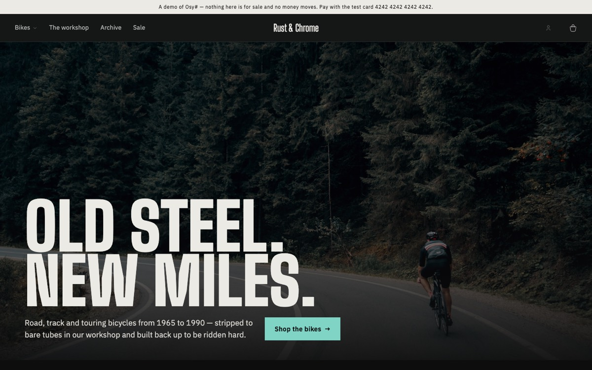
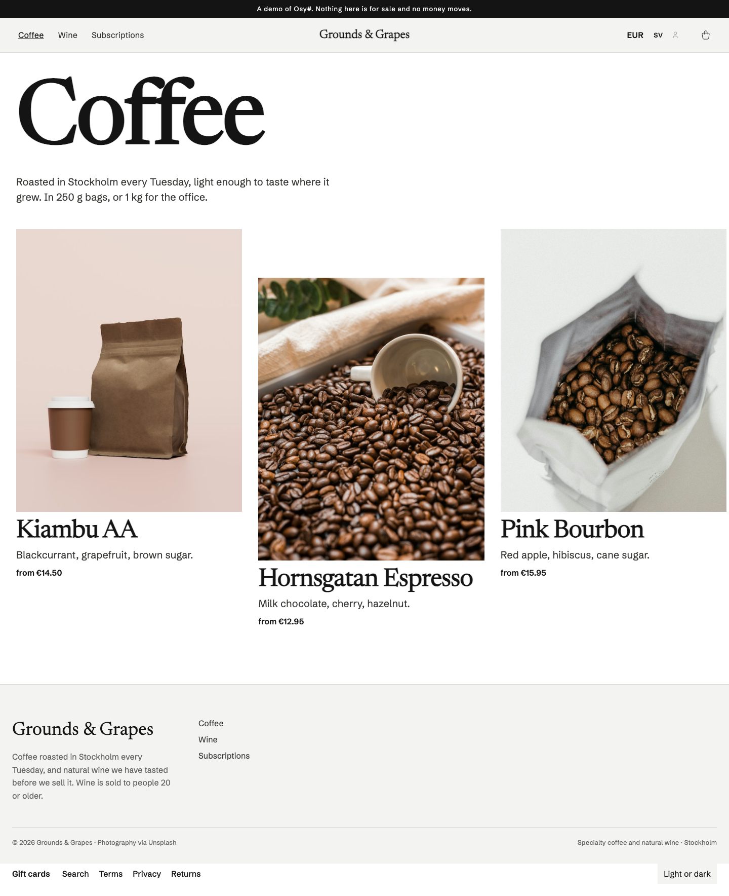
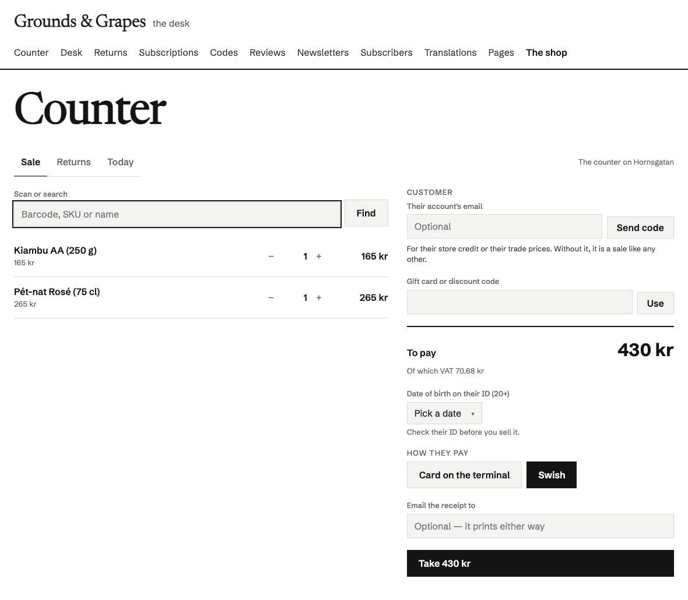
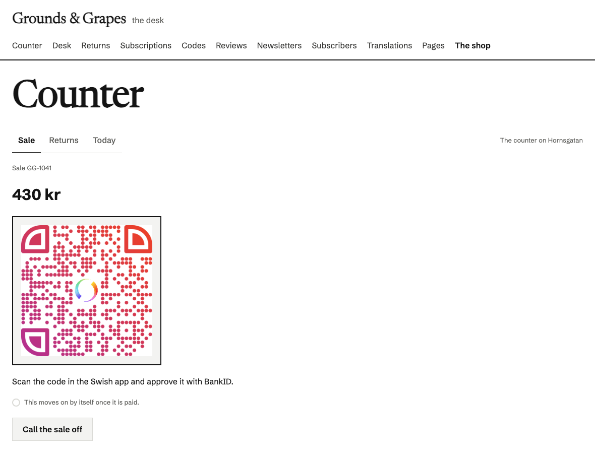

# Osysharp.Shop — an online shop's backend, and the parts of its pages every shop needs

## Use case

You sell physical things, and you want a shop you own rather than rent: your domain, your data, your design, and no
monthly fee per feature. This package covers what every shop needs and nobody wants to write twice. That means the
catalogue, accounts, the bag, orders that reserve stock, card and Klarna payments, receipts, returns and refunds, the
shop's mail and the staff desk. Your app supplies the design: the pages, the theme and the photographs.

The same package runs a bicycle workshop, a fashion label and a second-hand shop:

| | | |
|---|---|---|
|  |  |  |

Each of these is a **template** you can start from:

```console
osy init shop --style atelier
```

## What it ships

| area | what you get |
|---|---|
| **Catalogue** | categories as a tree, products with variants (size, colour) and their own stock and price, a spec sheet per product, photos, draft/listed/archived |
| **Accounts** | sign-up (which never says an address is taken — the mail tells its owner), an address proven by a mailed link or six-digit code before the first sign-in (`RequireConfirmedEmail`, off by default), sign-in, password reset by mail, change email and password; one principal with a Customer or Staff role; guest checkout still works |
| **The bag** | kept per visit and saved on the account, merged at sign-in, re-checked against stock on return; "mail me when it is back"; one reminder about a bag left behind (to a reader of the list the store names), whose "Back to your bag" is a `ResumeBag` link that opens the bag on any device, signed in or not (`ShopResumeBag`), at today's prices and stock, and stops once the bag is ordered or emptied |
| **Orders** | placing an order reserves its goods; an unpaid order lapses after the shop's hold days and puts them back; paid → sent → refunded, each step mailed. An order is read by the account it was placed from, the browser that placed it, staff — and whoever holds its link: every mail about it, the page a payment comes back to and the receipt carry an `OrderLink` (a year), opened by `ShopOrderByLink(link)` at `ShopSetup.OrderPath`; the reference alone opens nothing, and nobody lists orders. An order is priced by the shop: its workflow prices every customer's order again from the bag it came from, with the checkout's own computation, before it holds anything — an order written at any other price is refused. The link also sends things back — a guest has no account to return from: `ReturnWithLink`, by the account's own rules, refunded the way it was paid — and fetches the receipt. "Bought together" is a tally the order's workflow keeps; `BoughtTogetherRecount` (a row in the store's data, or `RecountBoughtTogether` at the desk) counts it again from every order, once or as often as asked, for orders paid before it existed |
| **Payments** | Stripe Checkout (card, wallets) with its signed webhook; Klarna's hosted page (charged when the order is sent); bank transfer; pay on collection; a payment link for an order staff took by phone, or an exchange's difference — a `Pay` grant (`SendPayLink`, `ShopPayByLink`) that works for seven days and is taken back once the order is paid or called off |
| **Receipts** | a PDF per order, kept private and handed to its owner as a signed link — to the account (`ReceiptLink`) and to whoever holds the order's link (`ReceiptLinkWith`, the same document without the buyer's name and address) |
| **Returns** | the customer returns lines from their order history within the shop's return window; staff accept them (the carrier that delivered books the return label, mailed as a PDF with its tracking; a carrier that cannot says so and the customer is told where to post it) and receive them; the refund goes back the way the money came, or as store credit |
| **Exchanges** | another size, colour or product instead of the money (`ExchangeItem`, or `ExchangeForCustomer` at the desk): the replacement is placed and held by its own order at once, linked to the original, sent free when the parcel is in; a dearer one is paid through a payment link for the difference, a cheaper one leaves the rest in store credit |
| **Store credit** | a ledger per account in the shop's currency, written only by the shop's workflows: given for a return or by staff with a reason, spent at the checkout in part or in full (`CheckoutStoreCredit`), given back when an order it paid is refunded or called off; the customer reads their own (`ShopMyStoreCredit`) |
| **Gift cards** | a product whose sizes are amounts, or the buyer's own amount (`Variant.AnyAmount`, between `GiftCardMin` and `GiftCardMax`), bought for somebody with a message and a day it arrives (`AddGiftCardToBag`); issued when the order is paid and mailed with its code, now or on that day. The code is never stored — only its keyed fingerprint (`Security.Fingerprint`) — and no card is ever listed: a shopper asks about a code (`GiftCardBalance`, `ApplyGiftCard`) and the shop answers. Spent at the checkout in part or in full beside any way to pay (`CheckoutGiftCard`); given back onto the card when the order is refused, cancelled or refunded, and in the part it paid when goods come back. Staff issue, adjust, void, re-code or send one early, each with a reason, and read its ledger (`DeskGiftCards`); what is left at expiry is written off. The buyer reads the cards they bought (`ShopMyGiftCards`), never what is left on them |
| **Digital products** | a variant that is a FILE — a PDF, an audio file, a zip — uploaded privately on the desk (`DeskDownloadFile`, `Upload(privately: true)`); never out of stock and never posted. A bag of nothing but files and gift cards has one delivery, "By email", free; paid is delivered. A download opens from the link in its mail (`DownloadLink`, `ShopDownload`) or from the account (`ShopMyDownloads`), `DownloadLimit` times for `DownloadDays` days, each time as a 15-minute signed link; staff open one again (`ReopenDownload`), a refund closes it. The checkout asks for, and the order keeps, the consent to have it at once (`CheckoutDigitalConsent`) |
| **Prices in the visitor's currency** | the visitor picks a currency (`ShowPricesIn`, kept per visit in `VisitCurrency`). Rates come from a provider the app lists (`ShopSetup.ExchangeRates` — `Osysharp.Shop.Ecb` asks the European Central Bank), fetched by a job (`StartExchangeRates`, or the desk's settings) as it starts and every six hours, never per page view, and kept per day (`ExchangeRateDay`); a rate older than `RatesStaleAfterDays` (6) converts nothing. Each offered currency is **SHOWN** or **SOLD** (below) |
| **Shown** | an estimate: "≈ €14.58", and where money changes hands "≈ €14.58 · charged as 165 kr" (`InTheirMoney`, `ShownMoney`, `ChargedAs`); the order, its invoice, VAT and payment are in the shop's own currency |
| **Sold** | real prices in that currency (`SellInCurrency`, the desk's "Sell in EUR"): each size's own price there (`VariantPrice` — the price list, edited in a size's details and carried by the spreadsheet as a "Price EUR" column), else its own price converted at the day's rate and rounded by the currency's rule (`PriceRounding`: .95, .90, whole units, 5s, 10s — the nearest such price). The bag is bought in it (`Bag.Currency`), the order is placed, invoiced and charged in it (`Order.Currency`, the day's `Rate` recorded on the order and on its invoice), and its invoice and credit notes state the VAT in the shop's own currency too. Delivery has its own price per option (`SoldDeliveryPrice`) and its own free-from (`ExchangeRate.FreeDeliveryFrom`), else both converted and rounded. A currency with no minor unit (the yen) can be shown, not sold |
| **Goods with an age** | `Product.MinimumAge` (wine at 20 in Sweden's retail, 18 elsewhere): the checkout asks for a date of birth (`SetBirthDate`) and refuses the underage; the carrier is booked to hand the parcel over against ID. Or the buyer PROVES it with an identity provider the app lists (`ShopSetup.AgeVerifier` — `Osysharp.Shop.BankId` for Swedish BankID): `StartAgeCheck`, then `AgeCheckNow` every second for the QR code (`AgeCheckView.Qr`) or the provider's app link, until the provider — asked by the server, never the page — says so. A verified order keeps only "at least N, when, by whom" (`Order.AgeVerifiedBy/At`), no date of birth; a declared one keeps the date and says "check ID". `AgeMustBeVerified` refuses a declared date. The desk and the packing slip say which (`DeskAgeLine`) |
| **Stock in several places** | locations (`StockLocation`) — a warehouse, a counter, a pop-up — each holding its own stock of each variant (`StockLevel`), with an address, and sending parcels, handing orders over, or both. A shop with ONE place has no locations and nothing changes; the first one added (`AddLocation`, the desk's Stock tab) makes the shop's own stock its DEFAULT location. An order is picked from one location (`Order.Location`, chosen by its workflow); holds, sales, lapses and refunds move stock there; transfers between locations are on the road until received (`SendTransfer`, `ReceiveTransfer`, `CancelTransfer`), every step a `StockMove`; returns go back where staff say (`ReceiveReturnAt`); a carrier books a parcel from its location's address (`ShipmentRequest.SendFrom`); a packer may be limited to one location (`LimitPacker`) |
| **Wholesale** | price lists (`PriceList`): a price of its own per variant, per sold currency where it matters (`PriceListPrice`), else a percentage off the retail price; minimum quantities and a minimum order; invoice terms. Staff make an account wholesale with its VAT number checked against the register (`MakeWholesale`, `ShopSetup.VatNumbers`); its bag is priced on its list, and an invoice (`ShopSetup.OnlyForWholesale`) is offered to it alone. The desk's Wholesale tab keeps the lists, the accounts and the invoices to be paid (`MarkInvoicePaid`) |
| **The counter** | a till for a tablet on the shop's counter (`ShopCounter`, for a `ShopRole.Counter` clerk or staff): scan a barcode or search into a sale at the clerk's counter, with what that location has on the shelf; a customer brought in by a code mailed to their account (their store credit, their trade prices); a gift card or discount code; paid by card on the shop's own terminal (recorded), Swish's QR code or a Stripe reader (`ShopSetup.CounterPayments`, `ICounterPayment`); handed over the moment it is paid, with a receipt printed or mailed; goods taken back over the counter the way they were paid. A counter sale is an ORDER — priced again by its workflow, invoiced, in the VAT report and the books like the web's (below) |
| **Figures** | top sellers, most viewed, slow movers, totals over a period |
| **Clearance** | mark a product down by a percentage until a date; a sale shelf |
| **Mail** | designed templates in your theme (`Osysharp.EmailTemplates`) — confirmations, dispatch, refunds, returns, resets — sent as HTML with a plain-text twin through Resend, or held in an outbox the desk can read and preview until a key is set |
| **Your words** | the confirmation, "on its way" and the refund each have a part staff rewrite on the desk in the Markdown editor, beside a live preview on a real order — with the mail's own `{placeholders}`, an unknown one refused at publish, and a reset to the default. Kept PER LANGUAGE: a customer gets the words written in the language they shopped in, else the template's own in that language, and the desk says which languages have the shop's words |
| **Newsletters** | staff write a newsletter's whole body in the Markdown editor, see it live in the shop's own mail, and send one test through the outbox. `CampaignFor(campaign, name, unsubscribe)` renders it for one reader — the seam a mailing list (not included) builds on |
| **The desk** | the kit's own staff pages — staff sign-in (`/staff`), the desk (`/staff/desk`, `ShopDesk`: tabs for figures, products, stock per location with transfers, returns, customers, wholesale, mail, newsletters and settings), the counter (`/staff/counter`) and the returns (`/staff/returns`) — standing in YOUR shell and listed in your navigation, with nothing written for them (below) |

The storefront pieces ship as components that take your theme's tokens, so they look like your shop: `ShopSearchPage`,
`ShopProductView`, `ShopNotifyWhenBack`, `ShopSignIn`, `ShopSignUp`, `ShopForgotPassword`, `ShopAccountPanel`,
`ShopOrderHistory`, `ShopPolicy`, `ShopPolicyLinks`, `ShopAccountButton`, `ShopOrderByLink(link)`, `ShopPayByLink(pay)`, `ShopResumeBag(link)`,
`ShopGiftCardBalance`, `CheckoutGiftCard`, `CheckoutDigitalConsent`, `ShopMyGiftCards`, `ShopMyDownloads`,
`ShopDownload(link)` and `ShopDesk`. A download's page is `[Page("/download/{link}")] component P(DownloadLink link)`
at `ShopSetup.DownloadPath`; the page a gift card's mail sends its holder to is `ShopSetup.GiftCardBalancePath`. The link pages take a grant, so a store puts them on a route that carries it —
`[Page("/order/{link}")] component O(OrderLink link)` at `ShopSetup.OrderPath`, the payment return
`[Page("/paid/{link}/{session}")] component R(OrderLink link, string session)` (calling `CheckPayment(link, session)`),
`[Page("/pay/{pay}")] component P(Pay pay)` at `ShopSetup.PayLinkPath`, `[Page("/bag/back/{link}")] component
B(ResumeBag link)` at `ShopSetup.ResumeBagPath` — and names its own page for a link that has run out with
`app.Ui = new AppUi { InvalidLinkSurface = … }`.

## Install and use

```osy
app MyShop {
  use Osysharp.Ui;
  use Osysharp.Workflow;
  use Osysharp.Storage;
  use Osysharp.Http;
  // The shop reaches Stripe, Klarna and Resend and reads their keys. This is where the app allows each one.
  use Osysharp.Shop@0 {
    egress "api.stripe.com"; egress "api.resend.com"; egress "api.klarna.com"; egress "api.playground.klarna.com";
    secret "StripeApiKey"; secret "StripeWebhookSecret"; secret "ResendApiKey";
    secret "KlarnaUsername"; secret "KlarnaPassword";
  }
  use Osysharp.Payments.Stripe@0 { egress "api.stripe.com"; }
  use Osysharp.Payments.Klarna@0 { egress "api.klarna.com"; egress "api.playground.klarna.com"; }
  use Osysharp.Resend@0 { egress "api.resend.com"; }
  model "model/**/*.osy";
}
```

Then three pieces of wiring, which are the app's to state because a package does not open routes or choose a login
page for you:

```osy
using Osysharp.Shop;

app.Auth = new PasswordAuth { LoginField = Email, PasswordField = PasswordHash };
app.AuthBootstrap = new AuthBootstrap {
  Role = ShopRole.Authenticator, LoginPage = AccountSignIn,          // AccountSignIn is YOUR page, around ShopSignIn()
  Login = ShopLogin, Signup = ShopSignup,
  PasswordResetRequest = ShopRequestPasswordReset, PasswordReset = ShopResetPassword,
  PasswordChange = ShopChangePassword, EmailChange = ShopChangeEmail,
  EmailVerify = ShopConfirmEmail, EmailVerifyCode = ShopConfirmEmailCode,
};

app.Apis = [
  new RestApi("Stripe") { Route = "stripe", Auth = new ApiAuth { Anonymous = true },
    Endpoints = [ new Endpoint(ShopStripeEvents) { Method = HttpMethod.Post, Path = "/events", Raw = true,
                                                   Headers = ["Stripe-Signature"] } ] },
  new RestApi("Klarna") { Route = "klarna", Auth = new ApiAuth { Anonymous = true },
    Endpoints = [ new Endpoint(ShopKlarnaEvents) { Method = HttpMethod.Post, Path = "/events", Raw = true } ] },
];
```

A payment method is offered only once it is configured, so a new shop takes bank transfers and nothing else:

```console
osy secret set StripeApiKey          # sk_test_… while you build
osy secret set StripeWebhookSecret   # whsec_…, for Stripe's webhook to https://your.shop/stripe/events
osy secret set KlarnaUsername        # and KlarnaPassword; the market is set in the desk
osy secret set ResendApiKey          # and "Mail from" in the desk's settings
osy user add you@yourshop.se --role Staff
```

**Proving an address before the first sign-in** is one setting — `app.Shop = new ShopSetup { …, RequireConfirmedEmail = true };`
— and a page for the link the mail carries: `[Page("/account/confirm/{token}")] [AllowAnonymous] component Confirm(string
token) { render { ShopConfirmAddress(token); } }`. Sign-up and sign-in then ask for the six-digit code the mail carries
(`ShopSignUp` and `ShopSignIn` show the step themselves), a new address and a taken one are answered alike (the mail
says which), and the FIRST proof of an address takes the account's password — or a new one, which signs every other
session out — so somebody who signed up first with another person's address loses it to its owner. It asks every
account that has not proven its address, those made before it was turned on too: each is sent a code at its next
sign-in. `EmailVerify`/`EmailVerifyCode` in the wiring above are what make the code and the link reachable before
sign-in; with them wired the platform's own password paths (`osyrin login`, `--as`) ask the shop too, and refuse an
account that has not proven its address.

To show prices in a visitor's own currency, list a rate provider and the currencies (the ECB's host is granted on its
own `use`, so a shop that shows one currency grants nothing):

```osy
// app.osy:   use Osysharp.Shop.Ecb@0 { egress "www.ecb.europa.eu"; }
app.Shop = new ShopSetup { …, ExchangeRates = new EcbRates(), DisplayCurrencies = ["EUR", "NOK", "DKK", "USD"] };
```

Then press "Show prices in other currencies" on the desk's settings (or call `StartExchangeRates()` as staff). A store
reads `VisitCurrency.Include(v => v.Rate).SingleOrDefault(v => v.VisitId == Visitor.Id)` once per page and hands it
to its own price function; the Grounds & Grapes demo store shows the picker, the estimates and the checkout's total in
kronor. Whether a visitor's country or browser language should choose the default is not decided — until then it is
the shop's own currency.

To SELL in a currency rather than show it, press "Sell in EUR" beside its rate (`SellInCurrency("EUR", true)`), then
"Prices and delivery…" for its rounding rule, its free-delivery threshold and each delivery option's own price. A
size's own price goes in its details on the desk (`SetVariantPrice`) or in the spreadsheet's "Price EUR" column; a
page renders it with `SoldPriceFrom(prices, ownPrice, rate)` over the `VariantPrice` rows it loaded. Grounds & Grapes
sells in euros this way (its `data/08–10`) while Norwegian and Danish kroner and dollars stay shown.



## Selling in another currency: the rules the kit follows

**The order is in the currency it was sold in; the books are in the shop's.** Every amount of an order in euros —
lines, discount, delivery, total, VAT per rate — is in euros, computed in euros, and charged in euros. The rate of the
day it was placed is recorded on it (`Order.Rate`, `RateDate`, `RateSource`) and the rate of the day it was paid on
its invoice (`Invoice.Rate`) — the day the VAT falls due for a sale paid in advance (EU VAT Directive 2006/112/EC,
art. 65). An invoice in another currency than the country's must state the VAT in the national currency (art. 230),
converted at the rate art. 91(2) allows — the latest selling rate on the most representative exchange market, or the
ECB's; Skatteverket accepts the ECB's rate. The receipt/invoice PDF and every credit note say "Prices in EUR. VAT in
SEK at the European Central Bank's rate of …: 1 EUR = 11.3205 SEK", and the VAT per rate in kronor
(`VatInShopCurrency`). A credit note is converted at its invoice's rate, so the VAT given back is the VAT declared.

**Discounts.** A percent works in any currency. An amount-off code is a promise in one currency — "100 kr off" on a
flyer is 100 kr — so it applies in a sold currency only once staff give it an amount there (`Osysharp.Shop.Discounts`'
`DiscountCodeAmount`, "Other currencies…" on the desk); a minimum spend without one set there is the shop's converted
at the day's rate (a threshold, not a price, so to the cent).

**Gift cards are in ONE currency** (`GiftCard.Currency`, the order's that sold it) **and pay only for an order in
it.** Converting a card at each day's rate would make it worth a different amount every day, which nobody who gave one
meant — and a card is a debt the books keep at the rate it was sold at (`GiftCard.Rate`). Put on a bag in another
currency, it says which currency to choose to spend it. A buyer shopping in euros buys a card of their own amount in
euros; the shop's bounds (`GiftCardMin`/`Max`) are converted into it.

**A card in a currency the shop no longer sells is reissued, at the rate it was sold at** (
`ReissueGiftCard`, the desk's "Reissue in SEK and mail it"). What is left moves to a NEW card in the shop's own
currency at `GiftCard.Rate` — never the day's rate: the card's debt is booked at the rate it was sold at, so moving it
at that rate earns and costs the shop nothing (the day's rate would book a currency gain or loss on a debt the shop
chose to move, and hand the holder more or less than was paid for), and the voucher stays what the buyer paid for.
The old card is voided WITHOUT a write-off (its entry is `Reissued`, not `Voided`: no 3990 income), the new one keeps
its kind — single- or multi-purpose, and the VAT a single-purpose card's sale paid — and its last day, and its code is
mailed to whoever the old one went to. Both ledgers name the other (`GiftCard.ReissuedAs` / `ReissuedFrom`). A card in
a currency still sold (its rate merely stale) is not reissued: it spends again once the rate is fresh.

**A subscription in a currency the shop stops selling moves to the shop's own** — see the subscriptions kit. Its
rounding there is the shop currency's rule, `ShopSettings.Rounding` (to the cent by default).

**Store credit is the shop's own money** and pays only for an order in the shop's own currency: a balance in two
currencies would be two debts to revalue at every closing. An order in a sold currency is therefore refunded the way it
was paid — never into store credit — and an exchange's leftover on it goes back the way it was paid too.

**An agreed price is in ONE currency** (`AgreedLinePrice.Currency`; a subscription's, from the subscriptions kit): it
is placed only in a bag bought in that currency (`SoldCurrencyProblem`), and an add-on that agreed one agrees it again
when the bag moves to another (`IShopAddOn.BagCurrencyChanged`). A subscription bought in a sold currency renews in it —
see the subscriptions kit's README.

**A way to pay is offered only where it can take the money** (`IPaymentProvider.CurrencyRefusal(currency, country,
sellers)`): Swish moves Swedish kronor only; Klarna takes each country's own currency and no other — `purchase_country`
and `purchase_currency` must pair, SE with SEK, DE with EUR ("We only support the local currency of each country",
https://docs.klarna.com/klarna-payments/in-depth-knowledge/puchase-countries-currencies-locales/); a `ManualPayment`
(a transfer, the till) takes the shop's own currency unless its `Currencies` names the account's others; Stripe takes
any currency and converts it into the account's at payout. The desk lists, per sold currency, what is not offered and
why.

**Payouts and the currency gain or loss** are the bookkeeping kit's (`Osysharp.Shop.Bookkeeping`, see its README).

## Gift cards and files: the rules the kit follows

**A gift card is money the shop owes, not a sale.** A card that can be spent on goods at different VAT rates (or
delivered to different countries) is a *multi-purpose voucher* under the EU VAT Directive, articles 30a and 30b, as
amended by Council Directive (EU) 2016/1065 and implemented in the Swedish VAT act (mervärdesskattelagen, 2023:200,
its rules on vouchers — *vouchrar*; see Skatteverket's guidance on vouchers). So selling one carries no VAT and is not
revenue: its line is left out of the order's VAT rows (`Order.GiftCardsSold`), the invoice and receipt say "sold
without VAT — the VAT is charged on the goods it pays for", and the bookkeeping export (`Osysharp.Shop.Bookkeeping`)
credits it to what the shop owes (BAS 2421, unredeemed gift cards). Spending one is a means of PAYMENT, like store
credit, never money off: the goods it buys are sales with all their VAT at their own rates, and the part the card paid
is debited from 2421 rather than the bank. What is left when a card expires or is voided is written off as income
without VAT (3990). A card staff give away is a cost (5990). A card whose own sale is refunded is voided without a
write-off — the credit note gave the money back.

**…or a single-purpose voucher, when the shop says so (`ShopSettings.GiftCardsAreSinglePurpose`, off by default; the
desk's settings: "Gift cards are single-purpose vouchers").** A voucher is *single-purpose* when the place of supply
of what it pays for AND the VAT due on it are known when it is issued (art. 30a(2)); then each transfer of it IS the
supply, so the VAT is due when it is SOLD, and the goods it later pays for are not taxed again (art. 30b(1)).
Skatteverket calls it an *enfunktionsvoucher* (mervärdesskattelagen 2023:200, 6 kap. — its rules on vouchers). With
the setting on:

- **Sale.** A card line carries the standard rate (`VatPercent`): it is in the order's VAT rows, the receipt and the
  confirmation say "a single-purpose voucher — its VAT, … is paid now", `Order.GiftCardsSinglePurpose` and
  `GiftCardsSoldVat` record it, and the card keeps the kind it was sold as (`GiftCard.SinglePurpose`, `VatPercent`),
  so turning the setting off or on never re-books a card already sold. Not in a sale without the shop's VAT (reverse
  charge, an export): a card whose place of supply is not the shop's is a multi-purpose one.
- **Redemption.** What a single-purpose card pays is out of the order's VAT rows — shared over the rates as the goods
  are — with the VAT paid inside it recorded (`Order.SinglePurposeUsed`, `VoucherVat`); the checkout
  (`CheckoutQuote`, `CheckoutTotals.GiftCardVatNote`), the receipt and the mail say so. Multi-purpose cards on the
  same bag pay as before.
- **Refund.** Refunding an unspent card gives its VAT back on the credit note; refunding goods a card paid for gives
  back VAT only on the part paid in money (`CreditNote.SinglePurposeBack`, `VoucherVat`) — what goes back onto the card
  had no VAT on that order. Nothing may be ADDED to a single-purpose card by staff (its VAT was paid on what it was
  sold for); taking from it is allowed.
- **Books** (`Osysharp.Shop.Bookkeeping`, its README): the sale credits 2421 with the card less its VAT and 2611 with
  the VAT; spending it debits 2421 by what it owed and credits `SalesSinglePurpose` (3009) with no VAT; the VAT report
  counts the card when sold and never when spent; expiry writes off what it owed, less the VAT, which stays declared.
- **Given away:** a card staff issue is ALWAYS multi-purpose — nothing was paid, so no VAT fell due, and what it buys
  carries its VAT (the conservative reading). The desk's "Issue a gift card" says a discount
  code or store credit is usually the simpler goodwill, with a way to either — the codes link is the discount codes
  kit's, added to the shop's `GiftCardGoodwill` slot.

⚠ **Only right for a shop whose goods all carry ONE VAT rate and which sells in ONE country.** A card that may pay for
goods at 25 % and at 12 %, or be spent by a customer abroad, does not know its VAT when it is sold — it is
multi-purpose whatever the shop calls it (art. 30a(3)), and charging the standard rate on its sale over-pays. The desk
says so while the setting is on (`GiftCardKindWarnings`): when the goods on sale carry more than one rate, and when the
shop sells abroad — One-Stop Shop registration, VAT-free sales to businesses in other EU countries, or orders sent to
another country in the past year. Sources: Council Directive 2006/112/EC articles 30a, 30b and 73a as inserted by
Council Directive (EU) 2016/1065; the Commission's explanatory notes on the voucher directive (2019); Skatteverket's
guidance "Vouchrar" (enfunktionsvoucher / flerfunktionsvoucher). Have the shop's accountant confirm the choice.

**Order of payment at the checkout.** Discount codes come off first (they are money off, and the VAT is worked out on
what is left); then gift cards pay, the one that expires first first; then store credit (which does not expire); then
the way to pay the customer chose, for the rest. Neither a gift card nor store credit pays for a gift card in the same
order, and a discount never comes off one.

**How long a card is valid.** `GiftCardMonths`, 24 by default, and the shop refuses less than 12. In Sweden a gift card
sold to a consumer must be valid for at least a year: a shorter validity is an unreasonable term (Allmänna
reklamationsnämnden's practice, and the Swedish Consumer Agency, Konsumentverket, in its guidance on gift cards, under
lagen (1994:1512) om avtalsvillkor i konsumentförhållanden). A card with NO stated validity would run for the general
limitation period of three years (preskriptionslagen, 1981:130, § 2) — the kit always states one, in the mail.

**Refunds.** Money paid with a card goes back onto that card — on a whole-order refund, a cancellation or a lapse, and
on a return in the part the card paid (as store credit goes back to store credit). A card that has since expired or
been voided gets a NEW card for it, mailed to whoever placed the order. An unused card that was bought can be refunded
by staff (`RefundPart`); it is then voided. One that has been spent from cannot.

**Files and the right of withdrawal.** A consumer has 14 days to withdraw from a distance purchase — but not for digital
content that is not on a tangible medium once its supply has begun with the consumer's prior express consent and
acknowledgement that they thereby lose the right (Directive 2011/83/EU, article 16(m); in Sweden 2 kap. 11 § lagen
(2005:59) om distansavtal och avtal utanför affärslokaler), and the trader must confirm that consent on a durable
medium (article 8(7)(b)). So a bag holding a file cannot be placed until the customer ticks
`DigitalConsentWords()`; the order keeps when (`Order.DigitalConsentAt`); the confirmation and the downloads mail
repeat the words; and a file cannot be returned from the account. A gift card is not digital content: its withdrawal
right stands, which is why an unused one can be refunded.

**VAT on a file.** A download sold to a consumer is an electronically supplied service, taxed where the buyer lives
(VAT Directive article 58). A bag with nothing to post asks for the buyer's country, and a shop registered for the
One-Stop Shop (`OssRegistered`) charges that country's rate for the product's class (a book at `Lower` is 7 % in
Germany, 6 % in Sweden). A shop not registered charges its own. The kit takes the country the buyer gives as the
evidence of where they live; a file in a bag that is collected at the counter is taxed as the shop's own sale.

## Stock in several places and wholesale: the rules the kit follows

**One place is no locations.** `Variant.Stock` and `Variant.Reserved` stay what the WHOLE shop holds. The default
location keeps whatever the others do not — its share is the totals less theirs, and it has no `StockLevel` rows — so
adding a second location moves nothing, and a data file's or a spreadsheet's `Stock` still means "in the shop" (the
difference is counted at the default, which can never go below nothing). Every move of stock goes through
`MoveStockAt`, which writes the location and the totals together; "mail me when it is back" follows the totals.

**One order, one location, one parcel.** A collection is picked at the counter it is collected at (with two or more
counters, each is its own delivery choice, `collect@<code>`); a parcel from the first location in the desk's order that
sends parcels and holds EVERY line. When no single place holds it all the checkout says so on that delivery
(`DeliveryChoice.Problem`) and it is not placed: the shop does not split an order into parcels: one
charge for delivery, one tracking number, one return. What a bag lets a
customer take is what the fullest selling location holds (`Buyable`).

**A wholesale price is the bag owner's.** `LinePrice` asks whose bag it is, not who is asking, so the checkout and the
order's workflow — which prices every customer's order again — agree; a guest's bag and a retail customer's are
retail. A price list's prices include VAT, as every price in the shop does (`ShownPrice` shows them without). A price
list and its prices are read by staff and the accounts on it alone. An order on invoice terms goes out before it is
paid: its workflow sells the goods, issues the invoice with its due date (`Invoice.DueAt`) and moves it to `Paid` with
no `PaidAt`; the invoice names the company and its VAT number, and says when and how to pay. The bookkeeping kit keeps
it owed (BAS 1510) until staff record the money.

## The counter: the rules the kit follows



| Swish at the counter: the customer scans the screen | |
|---|---|
|  | *From Grounds & Grapes, a coffee and wine shop built on the shop kit (`/staff/counter`).* |

**A counter sale is an order.** `PlaceCounterSale` places the counter's bag through the checkout's own path: the order's
workflow prices it again from the bag, takes its stock at the counter's location (`Order.Location`), and — paid — issues
its invoice and hands it over (`Delivered` at once, the receipt PDF written; mailed with the "collected" mail when the
customer gave an address). So the VAT report, the SIE file and the CSV count counter sales with the web's, and a return
over the counter is an ordinary return with its credit note. The order says where and by whom (`AtCounter`, `SoldAt`,
`SoldBy`) and how it was paid.

**Money is taken four ways.** A card on a terminal the shop runs itself (its bank's or acquirer's): the clerk charges it
there and presses Paid, with the slip's number if they like (`CardPaidAtCounter`); it is given back on that terminal, and
the bookkeeping kit keeps it in clearing (BAS 1580) until the acquirer pays out. Swish: the customer scans the code on the
screen with their own app, and only Swish's answer, asked over the shop's certificate, marks it paid. A Stripe reader
(Stripe Reader S700 or BBPOS WisePOS E, driven from the server; `StripeTerminal`): a `card_present` payment intent handed to
the reader, paid when Stripe says so, refunded by Stripe. And gift cards, store credit and discount codes as at the
checkout. `ShopSetup.CounterCardByHand = false` hides the first. Cash is not offered — see below.

**A clerk is bounded.** `ShopRole.Counter` sells at one counter when its grant names one (`LimitCounter`, the desk's
locations) and reads only what that counter hands over — its sales and the web's collections there; no parcel's order,
no desk, no figures, no invoices, no books. A customer joins a sale only by reading out the code the shop mailed to their
account; only then does the sale carry their account, and it is the order's workflow that puts it on the order.

**It is not a certified cash register.** Swedish law (skatteförfarandelagen 39 kap. 4–10 §§ and Skatteverket's rules on
kassaregister) requires a business that sells for cash — and card and Swish count as cash there: payment at the sale — to
register those sales in a manufacturer-declared cash register with a certified control unit (from 2027 also with an
XML journal), unless its cash sales are at most four price base amounts a year (236 800 kr in 2026) or the sales are
invoiced. This counter keeps every sale as an order with a sequential invoice number, which the bookkeeping law asks
for, but it has no control unit and is not declared: a Swedish shop above that threshold rings its counter sales through
a certified register (or sells on invoice). The same holds in other countries with fiscalisation rules (Norway's
kassasystemlova, Germany's KassenSichV, …) — check yours. Cash itself is not offered: counting a till, a float and a
Z report are a cash register's job.

## Extend it, or take it over

**Extend it first.** These are the seams, and none of them needs you to touch the package:

- **Your goods.** A spec sheet is data, so staff add "Frame size" or "Material" in the desk without a release. A
  subtype of your own, `entity Bike : Product { … }`, adds the fields every product you sell has.
- **Your pages.** Every page is yours. Place the kit's components where your design wants them, or write your own
  page against the same functions (`BagFor`, `PlaceOrder`, `MyOrders`, `TopSellers`, …). They are the same calls the
  kit's components make.
- **Your staff's frame.** The sign-in (`/staff` — signed in, it lists the staff pages each person may open), the desk,
  the counter and the returns are the kit's own pages, and every add-on puts its desk beside them (`/staff/codes`,
  `/staff/reviews`, `/staff/books`, `/staff/subscriptions`). Each stands in `[Layout(WorkspaceFrame)]` and puts
  itself in the navigation with `[Nav]`, so a store designs its staff frame ONCE and writes no page for any of them:

  ```osy
  component StaffShell() : WorkspaceShell {
    render {
      Stack(gap: 0) {
        Row(gap: 5) { foreach (var n in Nav.Pages()) { Link(href: n.To, label: n.Label) { Text(n.Label); } } }
        Slot;
      }
    }
  }
  ```
  Your own staff pages stand in the same frame (`[Layout(WorkspaceFrame)] [Nav("Orders", Order = 15)]`). To change one
  of the kit's, write a component of its name (`ShopDeskPage`); to leave one out, `use Osysharp.Shop@0 { without
  ShopCounterPage; }`. Their headings are `PageTitle`, which your own `PageTitle` dresses.
- **Your look.** The components read your theme's tokens (`Bg`, `Surface`, `Primary`, `TextMuted`, your fonts). Change
  the theme and the account pages, the search and the desk change with it.
- **Your prices and words.** How a price is written, the order prefix, the hold and return days, delivery, VAT and the
  terms, privacy and returns pages are all settings, edited in the desk.
- **Your frame.** The menu, the strip across the top and the footer can be your staff's to change at the page desk,
  in the site's versions: `live var menu = SiteMenu("menu", [ …your NavItems… ]);` for the menu, a
  `Region("announcement", allow: [Announcement])` in the shell's `promo` slot, and a `Region("footer", allow:
  [FooterWords, FooterLink, OpeningHours, Address, FooterSignUp])` in `StoreFooter`'s `about`
  slot — each with what you show today as its default (`ui-site-frame`).
- **Your designs — looks.** A store can install several [LOOKS](https://osyrin.com/templates/shop/#looks) and let staff
  pick one per version of the site: each draws the frame, the front page, the listings, a piece's page and every block
  type in its own design, over the same data and the same arrangement. The block types are contracts — the general
  site's (`Osysharp.Site.Looks`) and this kit's own, `Osysharp.Shop.Looks` (`ProductRow`, `CategoryTiles`, and the parts
  of a store: `ShopFrame`, `FrontPage`, `ShopSection`, `ListingPage`, `ProductGrid`, `ProductPage`, `NotFound`); the
  blocks in model/ui are this kit's plain design of them, drawn where no look has its own (`ui-looks`). The Vall fashion
  store wears five, and so does the Second Round second-hand shop ([the ten looks](https://osyrin.com/templates/shop/#looks)).
- **Your mail.** Every mail the shop sends — the order confirmation, "on its way" with its tracking button, the refund,
  the return code with its QR, a gift code, back-in-stock — is an `[Email]` template built with
  `Osysharp.EmailTemplates`, rendered in your theme as HTML plus a plain-text twin. The desk's Mail tab previews each
  one for a real recent order. **What the confirmation, on its way / collected and refunded say around the order is
  yours to arrange** — each holds a region (`shop-order-confirmation`, `shop-shipped`, `shop-collected`,
  `shop-refunded`) your staff arrange at the page desk (`Osysharp.Pages`), per language and in the site's versions: a
  paragraph in your voice, a photograph, a quote, a button. The confirmation keeps the order's lines (the block **The
  order**), and the right of withdrawal stays outside the region. Grant your staff `Osysharp.Blocks`' tables as for any
  page. A mail rendered while a member of staff previews the site is never sent — the outbox refuses it. To send your own version of one, derive from `ShopMails`, override that method, and
  list it: `app.Shop = new ShopSetup { …, Mails = new MyMails() };` — every other mail stays the kit's.

  ```osy
  public class MyMails : ShopMails {
    public override RenderedEmail OrderConfirmation(Order order, string? language = null) {
      return MyConfirmation(order, language: language);    // the desk previews it in the language it is editing
    }
  }
  ```
- **What happens to an order — events.** The shop tells it as events: `OrderPlaced`, `OrderPaid`, `OrderSent`,
  `OrderDelivered`, `OrderCancelled`, `OrderRefunded` and `ReturnRefunded`. Hear one anywhere — in your app or a kit —
  with `[On] void Tell(OrderPaid e) { … e.Order … }`; nothing is registered. Because they are events, the kits that work
  on any event reach them too: a webhook subscribed to `shop.order-paid`, an automation `When = On<OrderSent>()`.
- **Add-ons — another kit that prices a basket.** Discount codes (`Osysharp.Shop.Discounts`), subscriptions
  (`.Subscriptions`) and reviews (`.Reviews`) implement `IShopAddOn`: what comes off a basket (`Adjust`), why one may
  not be ordered (`Refuses`), a product's rating, what to forget of an erased customer. **The shop finds every add-on
  in the app — its `use` line is the whole of installing one** (`use Osysharp.Shop.Discounts@0 { without DiscountCodes; }`
  leaves one out). Write your own the same way, in your app or a kit of your own.
- **Another country's e-ID.** Age verification is a seam like payment and delivery: derive from `AgeVerifier`,
  set `Key` and `Label`, and override `Offered`, `Start` (answer a handle the shop keeps encrypted, and an app link),
  `Frame` (a QR code's text for a second, or ""), `Collect` (answer `Verified` with the date of birth, `Waiting` or
  `Failed` with a sentence) and `Cancel`. The shop seals what it keeps and never shows the handle to the page.
- **Prices without VAT, for a shop selling to businesses.** `PricesExcludeVat` on the desk; a page shows
  `Money(ShownPrice(p.Price, p.Vat, shop), shop)` and `PriceNote(shop)` ("excl. VAT"), and `CheckoutTotals.Net` is the
  total without its VAT. Prices are still entered, stored and charged with VAT in them. A shop selling to consumers in
  the EU must show prices with VAT, so it stays off there.

**Take it over when you outgrow it.** When your shop needs to work differently at its core, copy this package's
`model/` into your app, drop the `use Osysharp.Shop` line and the grants, and it is your code. From then on you are off
the package: you get no updates, but you can change anything. Nothing in it is privileged. It is ordinary Osy#, so
the copy compiles exactly as the package did.

## Source and tests

It depends on `Osysharp.Payments.Stripe`, `Osysharp.Payments.Klarna`, `Osysharp.Resend`, `Osysharp.EmailTemplates` and
`Osysharp.PdfWriter`, which `osy lock` resolves the same way.

`tests/` is the producer's own project: tests over the whole flow (placing, paying, lapsing, sending, refunding,
returning, store credit, gift cards, downloads, the desk and the account pages), with Stripe, Klarna and Resend
stubbed. It does not ship with the package.

