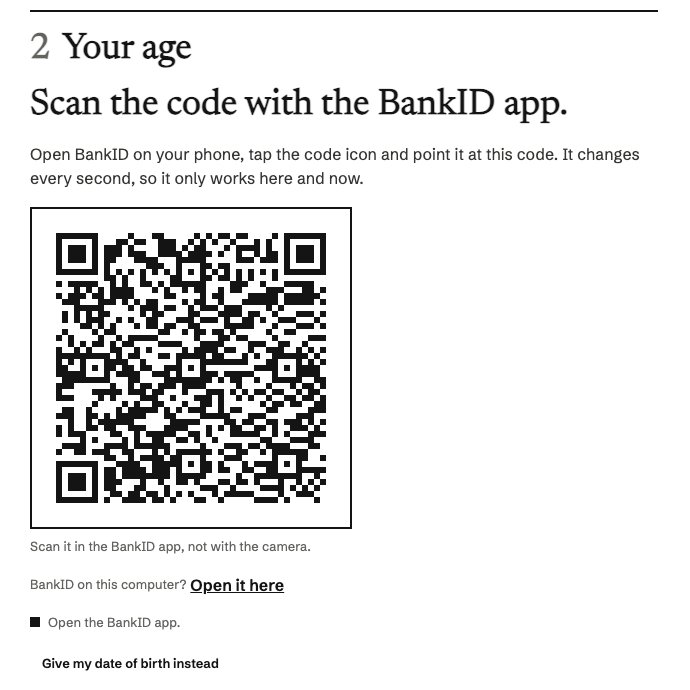

# Osysharp.Shop.BankId — prove a buyer's age with Swedish BankID

The shop's age check (`Osysharp.Shop`'s `AgeVerifier`) over [BankID](https://www.bankid.com). A buyer of wine — or of
anything with `Product.MinimumAge` — identifies with BankID instead of typing a date of birth, and the shop learns
that they are old enough. Nothing else it keeps.

## Use case

A Swedish shop that sells goods with an age: wine, beer, tobacco, knives, games with a rating. A typed date of birth
proves nothing, so a parcel sold that way has to be handed over against ID. A BankID check proves the age at the
checkout, and the order says so: the desk and the packing slip read "Age 20+ verified with BankID. No ID to ask for."



*The Grounds & Grapes demo store: on a computer the animated code the BankID app scans; on a phone the
button that opens BankID there. The page and its words are the store's; the check is this kit's.*

## Use

```osy
// app.osy
app MyShop {
  model "**/*.osy";
  use Osysharp.Shop@0 { egress "api.resend.com"; secret "ResendApiKey"; }
  // Osysharp.Shop.BankId is not written: it arrives by itself, because the app uses what it completes (`osy lock` says so)
  use Osysharp.BankId@0 {
    egress     "appapi2.bankid.com";
    egress     "appapi2.test.bankid.com";
    clientCert "BankIdCert";
    serverCa   "BankIdCa";
  }
}

app.Secrets = [ new Secret("BankIdCert"), new Secret("BankIdCertPassword"), new Secret("BankIdCa") ];

app.Shop = new ShopSetup {
  // …
  AgeVerifier = new BankIdAgeCheck { CertificateSet = Security.IsSecretSet("BankIdCert") },
  AgeMustBeVerified = false,       // true: a date of birth is not taken at all
};
```

Then the checkout's age step calls `AgeVerifiedWith()` ("BankID", or "" while the certificate is not set, and the
page asks for a date of birth), `StartAgeCheck(Visitor.Id, "/checkout")`, and `AgeCheckNow(Visitor.Id)` once a second
while it waits: its `Qr` rows are the code to draw (dark on light, a four-module margin), its `AppLink` opens BankID on
the same device. `PlaceOrder` does the rest.

`BaseUrl` defaults to PRODUCTION. For BankID's test environment set
`BaseUrl = "https://appapi2.test.bankid.com/rp/v6.0"` and use the test certificate and root BankID
publishes for it — the [BankId kit](https://osyrin.com/templates/kits/bankid/) carries both in its `testcert/` folder
(never commit a certificate to your app).

## What is kept, and what is not

BankID answers a completed order with the person's **personal identity number** and name. `BankIdAgeCheck.Collect`
turns the number into a date of birth (`BirthDateOfPersonalNumber`: twelve or ten digits, the `-`/`+` century rule,
the check digit, a coordination number's day + 60, an unknown day read as the youngest the person could be) and hands
the shop only that date. The shop compares it with the bag's age and keeps **only that the buyer is at least that
old, when, and by whom** — no number, no name, no date of birth. That is all selling the goods, booking the parcel or
answering an inspector needs (data minimisation, GDPR art. 5(1)(c)).

## How it cannot be faked

The check is the customer's own row, so what it says is worth nothing on its own. The server asks BankID itself; a
verified check carries a seal only the server can compute, over the bag it was made for, the provider, the age and the
time; the order's workflow prices the order again and compares. A check copied to another visit's bag, a seal written
by hand, or BankID's handle lifted from somebody else's check proves nothing.

`endUserIp` is the buyer's address as the platform received the request (`Request.ClientAddress`), never the
server's.

## Source and tests

`model/BankIdAgeCheck.osy`, over `Osysharp.BankId`. `tests/` is the producer's project, every call to BankID stubbed —
the personal identity number rules among them.

