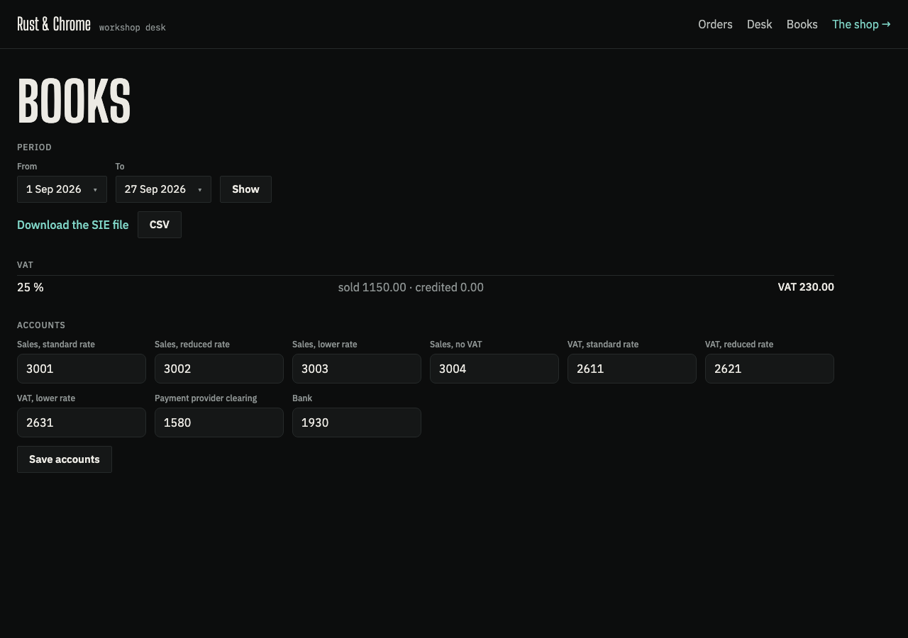

# Osysharp.Shop.Bookkeeping

A shop's books, from what the shop already records: every invoice is a sale and every credit note a sale given back.
An add-on to [Osysharp.Shop](https://osyrin.com/templates/kits/shop/): `use` it, and the books page stands in the store's desk and the accountant gets a file.



- **SIE 4** — the Swedish bookkeeping interchange (Fortnox, Visma, Björn Lundén): one verification per day, sales and
  output VAT per rate, against a clearing account for provider payments (card, Klarna) and the bank for what was paid
  by hand. Encoded PC8, as the format requires.
- **CSV** — one row per document and VAT rate, for Xero, QuickBooks or a spreadsheet.
- **The VAT report** — per rate, for any period: sold, credited, and the VAT owed.
- **Payouts, reconciled** — each payout from Stripe or Klarna matched to the orders it pays for (and any payment the
  shop has no order for, flagged), and booked: the bank receives the net, the provider's fees are a cost (6570), the
  provider clearing account is emptied. So the bank line "Stripe 12 431,20" explains itself.
- **Money the shop owes** — a gift card sold is a debt, not a sale (a multi-purpose voucher: no VAT until it is
  spent), credited to 2421; spending one debits 2421 and the goods it buys are sales with all their VAT; store credit
  spent or given back moves 2420 the same way; a card or credit staff give away is a cost (5990); what is left on a
  card when it expires or is voided is income without VAT (3990). The CSV carries a gift card sold as its own
  `voucher` row. A card whose own sale is refunded is voided WITHOUT a write-off: the credit note already took the
  debt back, so the refund is booked once. A card REISSUED in the
  shop's own currency (its own no longer sold, the shop kit's `ReissueGiftCard`) is its own verification: 2421 debited
  for what the old card owed (at the rate it was sold at) and credited for the new card — the debt moved, no sale, no
  VAT, no write-off; what converting each side to the öre leaves (a single-purpose card's VAT, rounded twice) goes to
  3960/7960.
- **Single-purpose gift cards** — for a shop that sells them (`ShopSettings.GiftCardsAreSinglePurpose`, see the shop
  kit's README; VAT Directive 2006/112/EC art. 30a(2) and 30b(1), Skatteverket's *enfunktionsvoucher*) the VAT is due on
  the SALE: 1930 debit 500, 2421 credit 400, 2611 credit 100. Spending it: 2421 debit 400, and the goods it paid for
  credited to `SalesSinglePurpose` (3009, *Försäljning mot enfunktionsvoucher, moms redovisad vid försäljningen*) with
  no VAT — kept apart from 3001–3003 so it is never read as a second taxable sale. The VAT report counts the card when
  it is sold and never when it is spent (file the VAT return from it, not from the sales accounts); the CSV marks what
  such a card paid as a `voucher-paid` row. A refund of the card gives its VAT back; a refund of what it paid gives back
  VAT only on the part paid in money. A card that expires writes off what it owed (400), and its VAT stays declared.
- **Sales in another currency** — a shop that SELLS in a currency besides its own (Osysharp.Shop's "Sell in EUR")
  keeps its books in its own: each such sale is its own verification, converted at its INVOICE's rate — the rate of
  the day it was paid, which the invoice records and states its VAT at (VAT Directive 2006/112/EC art. 230, with
  art. 91(2) allowing the ECB's rate) — and its text names the currency, the amount and the rate: "sale GG-1041,
  EUR 110.00 at 11.3205 SEK/EUR (European Central Bank, 2026-09-28)". A credit note is converted at its invoice's rate,
  so the VAT given back is the VAT declared; a gift card in euros is owed at the rate it was sold at. The VAT report
  and the CSV are in the shop's currency; the CSV adds `currency`, `gross_in_currency` and `rate`.
- **Currency gains and losses** — what a payout actually brought in for a sale in another currency, against what the
  sale was booked at, is a gain (3960 *Valutakursvinster på fordringar och skulder av rörelsekaraktär*) or a loss (7960
  *Valutakursförluster på fordringar och skulder av rörelsekaraktär*), booked with the payout. The rate it settled at
  is the provider's own where the provider converted it — Stripe's balance transaction carries `exchange_rate`
  (https://docs.stripe.com/api/balance_transactions/object), read into `PayoutLine.SettledRate` — and, for a payout that
  is itself in the sale's currency (Klarna settles each currency in itself), the ECB's rate of the payout's day, kept by
  the shop's rate job (`ExchangeRateDay`). The clearing account is emptied by exactly what was booked into it.
- **Accounts** — the BAS numbers by default (3001/3002/3003/3004 sales, 2611/2621/2631 VAT, 1580 provider clearing,
  1930 bank, 6570 provider fees, 2421 gift cards, 2420 store credit, 5990 given away, 3990 expired cards, 3009 what a
  single-purpose gift card paid for, 3960/7960 currency gains and losses — the BAS chart, bas.se), editable on the desk.

## Use it

```osy
// app.osy
use Osysharp.Shop@0 { egress "api.resend.com"; secret "ResendApiKey"; }
use Osysharp.Shop.Bookkeeping@0;
```

That is all: the books are the kit's own page, `/staff/books` (`BooksPage`), standing in the store's staff frame
(`WorkspaceShell`) and listed in its navigation (`[Nav]`). The panel itself is `DeskBookkeeping()`, for a page of your
own; the chart of accounts is a section of the store's settings.

From code: `Verifications(from, to)`, `VatReport(from, to)`, `SieText(from, to)` / `SieLink(from, to)`,
`CsvText(from, to)` / `CsvLink(from, to)` — periods are `DateOnly`, both ends included.

The books read the shop's invoices and credit notes, never its orders: an order changes, a document does not, so an
export of a period comes out the same whenever it is made.
