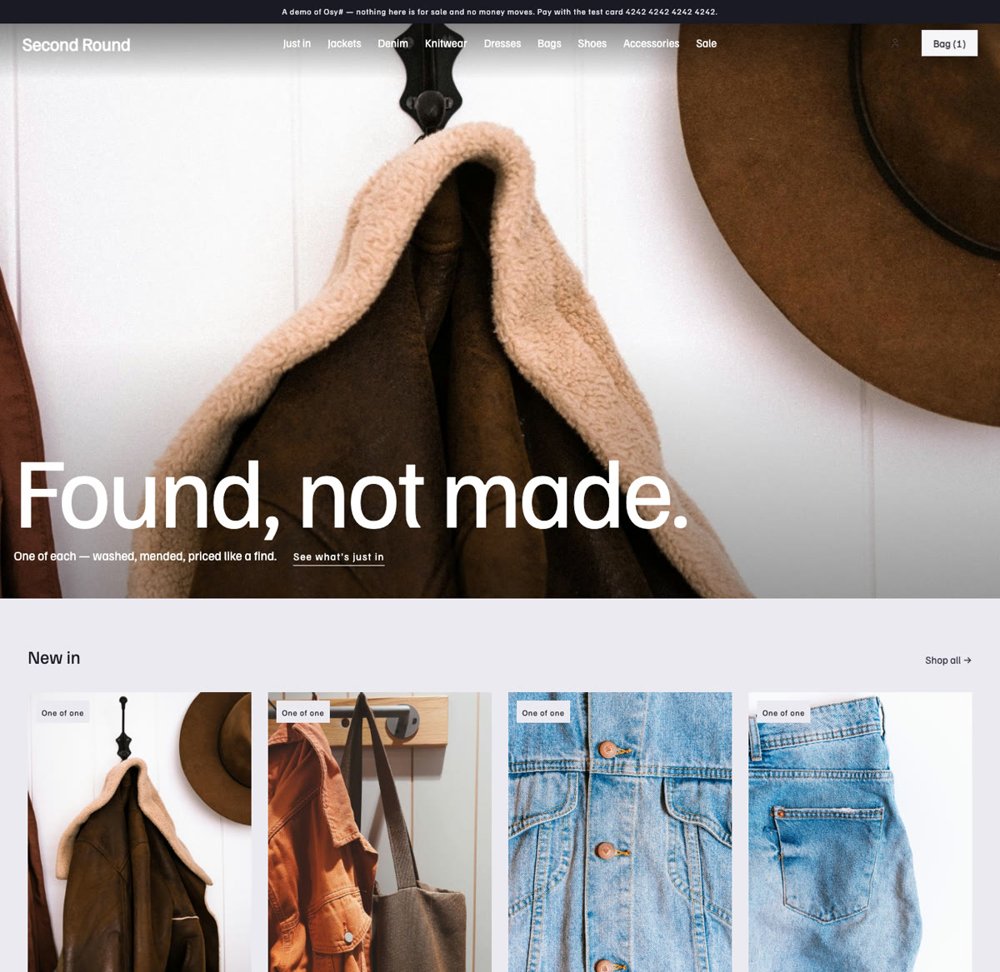
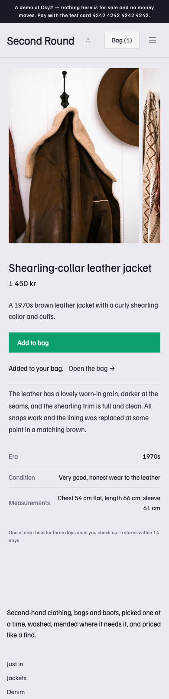

# Osysharp.Shop.Looks.Kiosk

**A look for shops: draws `Osysharp.Site.Looks` and `Osysharp.Shop.Looks`.** Its own design of all seven parts of a store (the frame and the pages) and of the hero, the footer's words, the product row and the shelves; the other block types fall back to the shop kit's plain designs, in this look's theme.

A **look** for a shop — "the kiosk". A pale lilac-grey ground, ink type in Familjen Grotesk set light and large, the find full-bleed under a floating header like a magazine cover, and one accent — emerald — for what to press. The front page is one find, full-bleed, then what is new and the dresses, boots and bags as tall photographs.

Install it in a store beside other looks, and the people who run the store pick it per version of the site at the page
desk (`/staff/pages`): drafted, previewed as a whole site, switched on a date. Orders, stock, customers and everything
staff arranged stay put — the Kiosk redraws the same words and photographs in its own design.

- **The frame:** the kit's EditorialShell — a wordmark with the shelves beside it, floating over the front page's photograph; the menu (`SiteMenu("menu", …)`), the strip across the top (`Region("announcement")`)
  and the footer's words (`Region("footer")`), each staff's to arrange, under the names every look uses — so what staff
  arranged comes along whichever look the store wears.
- **The pages:** the front page (a region of blocks), a listing, the grid, a piece's page, and a "not here".
- **Its designs of the block types:** the hero (full-bleed with its line over the foot — or a hero of words on the lilac ground when there is no photograph), the product row, the shelves and the footer's words. A type it has no design of is drawn in the shop kit's plain design.
- **Its theme and fonts:** the palette, type scale, radii and motion, served only while the store wears the Kiosk
  (`:root[data-look="kiosk"]`); Familjen Grotesk, registered in this kit's `osyrin.lock` and shipped with the store that installs it.
- **Whatever the visitor's system is set to:** every colour the shop kit and its add-ons paint with is the look's own —
  raised panels and wells (`Elevated`, `Sunken`) and the four statuses included — so a visitor in dark mode sees the
  look as it was designed, not the platform's dark menus inside it. `osy kit tokens --app` lists nothing left at the floor.
- **The store's name** in the wordmark and the footer's sign-off is the shop's own (`ShopSettings.Name`, set at the desk).

It draws the general site contract (`Osysharp.Site.Looks`) and the shop's (`Osysharp.Shop.Looks`), with exactly their
parameters — the compiler checks each design like a class against an interface. It carries **no data and no logic** and
needs no egress and no secret: it reads what a store's page reads, as the visitor. Its default front page names the
Second Round catalogue's pieces and photographs (`/_osy/files/public/products/…`); staff replace them at the desk.

- Worn by the Second Round thrift store, whose tests walk the shop in every look at a phone's width and a wide screen's (`osy test --pixels`).
- `osy docs ui-looks` — looks, contracts, and switching a version's look.
- `osy docs ui-building-a-look` — building a look of your own, from an empty kit.
